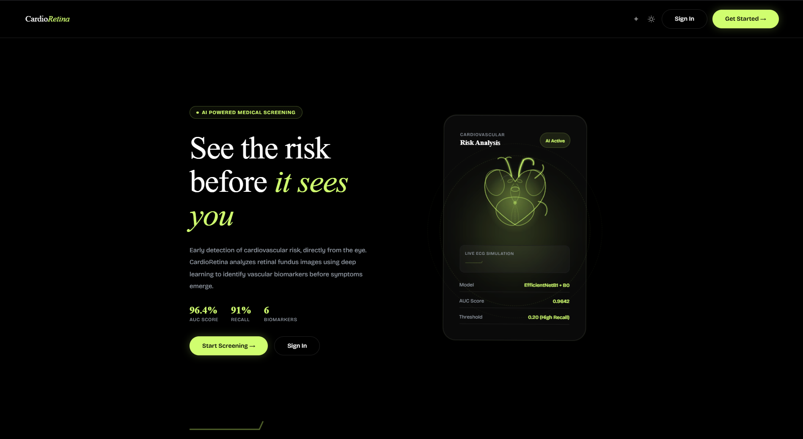
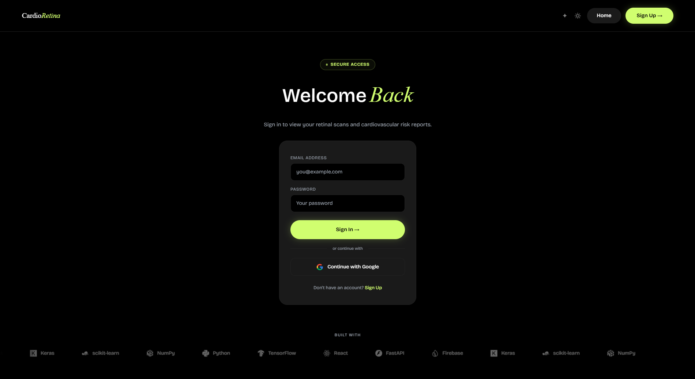
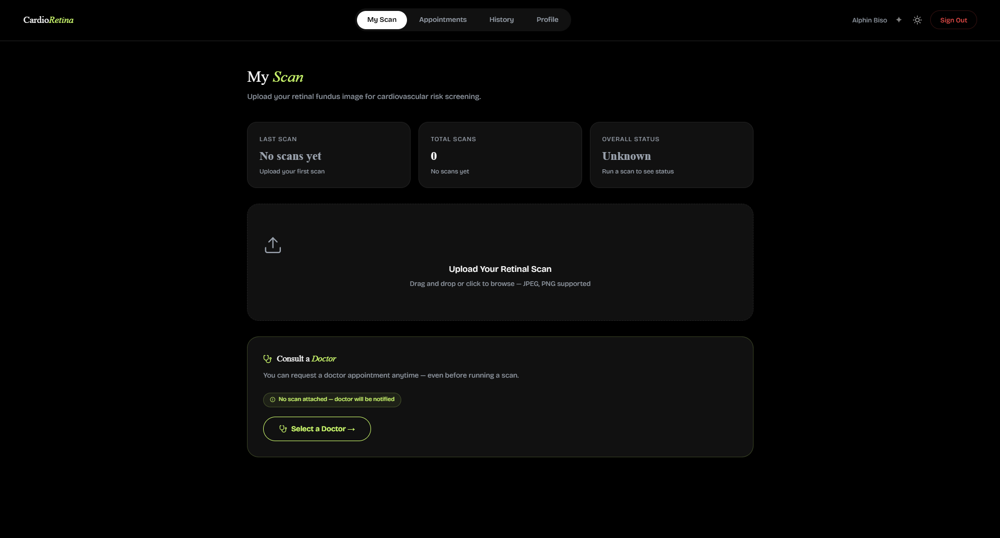
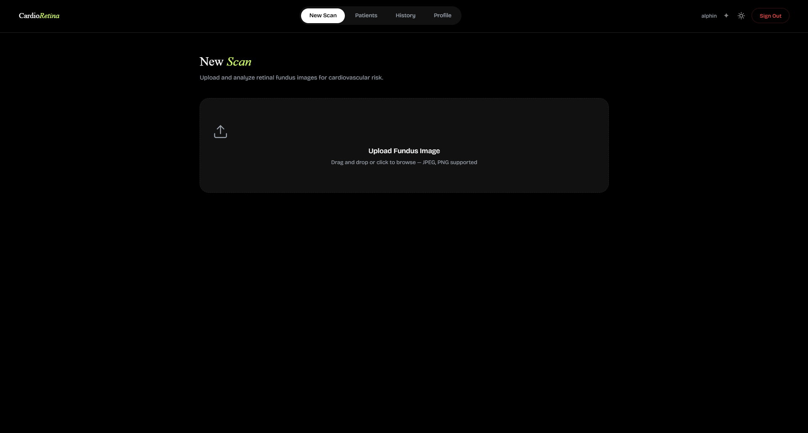
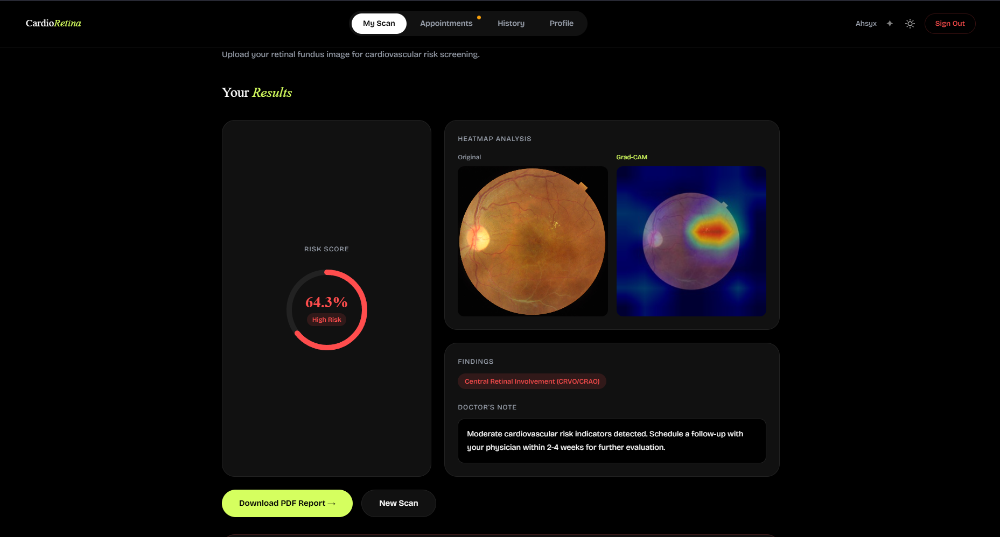

# 👁️ CardioRetina  
### AI-Powered Cardiovascular Risk Prediction Using Retinal Fundus Images

<p align="center">
  
  
  
  
  
  
  
</p>

<p align="center">
  <strong>AI-Powered Healthcare Platform for Cardiovascular Risk Detection using Retinal Fundus Images</strong>
</p>

---

## 🌐 Live Demo

🔗 **Website:** https://cardio-retina.vercel.app/

> CardioRetina is publicly deployed and accessible online.

---

# 📌 Overview

**CardioRetina** is a modern **AI-powered healthcare platform** designed to predict **cardiovascular risk using retinal fundus images**.

The system uses **Deep Learning**, **Computer Vision**, and **Explainable AI (XAI)** to analyze retinal blood vessel structures and detect patterns linked to cardiovascular abnormalities.

Unlike traditional cardiovascular screening methods, CardioRetina provides a **non-invasive, fast, and accessible approach** using retinal imaging.

The platform supports:

- 🩺 **Cardiovascular Risk Prediction**
- 🔥 **Grad-CAM Explainable AI Visualization**
- 👨‍⚕️ **Doctor Dashboard**
- 👤 **Patient Dashboard**
- 📅 **Appointment Scheduling**
- 📈 **Risk Analysis & Recommendations**
- 📂 **Scan History Management**
- 🔐 **Secure Authentication**
- 📄 **Clinical Report Generation**

---

# 🎯 Problem Statement

Cardiovascular diseases (CVDs) are among the **leading causes of mortality worldwide**.

Conventional diagnosis methods often involve:

- Invasive procedures
- Laboratory tests
- Costly examinations
- Specialist consultations

Research shows that **retinal blood vessels reflect vascular health**, making retinal images a valuable indicator for detecting cardiovascular abnormalities.

**CardioRetina solves this problem by leveraging AI to analyze retinal fundus images and provide cardiovascular risk predictions in a non-invasive manner.**

---

# 🚀 Objectives

The main objectives of CardioRetina are:

- Develop an **AI-powered cardiovascular screening system**
- Analyze **retinal fundus images**
- Predict **cardiovascular disease risk**
- Provide **visual explainability using Grad-CAM**
- Assist healthcare professionals with AI-driven insights
- Enable **doctor–patient interaction**
- Maintain patient history and appointments
- Improve accessibility to preventive healthcare

---

# ✨ Key Features

## 🧠 AI-Based Cardiovascular Risk Prediction

Predicts cardiovascular disease risk from retinal fundus scans using Deep Learning.

---

## 🔬 Ensemble Deep Learning Model

Uses an advanced **EfficientNetB1 + EfficientNetB0 ensemble architecture** for improved prediction accuracy.

---

## 🔥 Explainable AI (Grad-CAM)

Visualizes retinal regions responsible for predictions using **Grad-CAM heatmaps**.

This improves:

- Transparency
- Interpretability
- Medical trust

---

## 👨‍⚕️ Doctor Dashboard

Doctors can:

- View patient retinal scans
- Analyze cardiovascular risk
- Approve/reject appointments
- Review patient history
- Generate reports
- Track patient progress

---

## 👤 Patient Dashboard

Patients can:

- Upload retinal images
- View predictions
- Request consultations
- Check appointment status
- Access scan history
- Download reports

---

## 📅 Appointment Scheduling

Integrated doctor–patient consultation system with:

- Appointment requests
- Approval/rejection
- Scheduling system
- Real-time updates

---

## 📄 Clinical Report Generation

Generates medical reports containing:

- Risk score
- Confidence level
- Detected conditions
- Recommendations
- Heatmap visualizations

---

## 🔐 Authentication & Security

Secure authentication using:

- Email & Password Login
- Google Sign-In
- Firebase Authentication
- Protected Routes
- Role-Based Access Control (RBAC)

---

## 🎨 Modern UI/UX

- Responsive Interface
- Dark Mode
- Purple Theme
- Smooth Animations
- Healthcare-Oriented Design

---

# 🏥 Real World Applications

- Preventive Healthcare
- Early Cardiovascular Screening
- Hospital Decision Support
- Telemedicine
- Ophthalmology-Assisted Diagnosis
- Remote Patient Monitoring

---

# 🧠 AI/ML Architecture

CardioRetina uses an **Ensemble Deep Learning Model** to improve prediction accuracy and reliability.

The AI system combines:

- **EfficientNetB1**
- **EfficientNetB0**

using an **ensemble prediction mechanism**.

This approach improves:

- Model robustness
- Prediction consistency
- Accuracy
- Generalization performance

---

## 🔥 Test Time Augmentation (TTA)

To improve prediction reliability, CardioRetina uses **Test Time Augmentation (TTA)**.

The retinal image undergoes multiple augmentations such as:

- Horizontal Flip
- Vertical Flip
- Brightness Adjustment
- Contrast Enhancement
- HSV Color Transformations

Predictions from augmented versions are combined to generate a **more stable final output**.

---

## 🔥 Explainable AI with Grad-CAM

CardioRetina uses **Grad-CAM (Gradient-weighted Class Activation Mapping)** to visualize retinal regions responsible for AI predictions.

Grad-CAM provides:

- Better transparency
- Medical explainability
- Improved doctor trust
- AI interpretability

Heatmaps visually highlight affected retinal blood vessel regions influencing cardiovascular risk.

---

# 🏗️ System Architecture

```text
                     ┌────────────────────┐
                     │     User Login     │
                     └─────────┬──────────┘
                               │
                    Firebase Authentication
                               │
            ┌──────────────────┴──────────────────┐
            │                                     │
     Patient Dashboard                     Doctor Dashboard
            │                                     │
            └──────────────┬──────────────────────┘
                           │
                    Retinal Image Upload
                           │
                           ▼
                  FastAPI Backend Server
                           │
                           ▼
                   Image Preprocessing
                           │
                           ▼
        EfficientNet Ensemble Model (B1 + B0)
                           │
                           ▼
                  Test Time Augmentation
                           │
                           ▼
                   Cardiovascular Prediction
                           │
       ┌───────────────────┼───────────────────┐
       │                   │                   │
       ▼                   ▼                   ▼
  Risk Score         Grad-CAM Heatmap   Recommendations
       │
       ▼
   Firestore Database
       │
       ▼
 Dashboard Visualization
```

---

# 🔄 Workflow

### Step 1 — User Authentication

The user logs in using:

- Email & Password
- Google Authentication

Authentication is securely managed using **Firebase Authentication**.

---

### Step 2 — Role-Based Access

Users are redirected based on role:

- **Doctor → Doctor Dashboard**
- **Patient → Patient Dashboard**

Protected routes prevent unauthorized access.

---

### Step 3 — Retinal Image Upload

Patient uploads a **retinal fundus image** through the dashboard.

Supported features include:

- Drag & Drop Upload
- Image Preview
- Validation

---

### Step 4 — Backend Processing

The uploaded retinal image is sent to the **FastAPI backend**.

The backend performs:

- Image preprocessing
- Noise handling
- Feature extraction
- Model inference

---

### Step 5 — AI Prediction

The ensemble model predicts:

- Cardiovascular Risk Score
- Risk Classification
- Confidence Level
- Retinal Conditions

---

### Step 6 — Explainable AI

Grad-CAM heatmaps are generated to highlight retinal regions influencing the prediction.

---

### Step 7 — Result Visualization

Results are shown inside dashboards with:

- Risk Gauge
- Risk Percentage
- Heatmap Visualization
- Recommendations
- Patient History

---

### Step 8 — Doctor Consultation

Patients can:

- Request appointments
- Receive consultation approval
- Track appointment status

Doctors can:

- Accept appointments
- Reject appointments
- Manage patient records

---

# 🛠️ Tech Stack

## 🎨 Frontend

| Technology | Purpose |
|------------|----------|
| React 19 | UI Development |
| Vite | Frontend Build Tool |
| React Router DOM | Navigation & Routing |
| TailwindCSS v4 | Styling |
| Framer Motion | Animations |
| Lucide React | Icons |
| Context API | Authentication State |

---

## ⚙️ Backend

| Technology | Purpose |
|------------|----------|
| FastAPI | Backend API |
| Python | Server-side Logic |

---

## 🧠 Artificial Intelligence / Machine Learning

| Technology | Purpose |
|------------|----------|
| TensorFlow | Deep Learning |
| Keras | Model Training |
| EfficientNetB1 | Risk Prediction |
| EfficientNetB0 | Ensemble Learning |
| NumPy | Data Processing |
| Scikit-learn | ML Utilities |
| Grad-CAM | Explainable AI |

---

## ☁️ Database & Cloud

| Technology | Purpose |
|------------|----------|
| Firebase Authentication | User Authentication |
| Cloud Firestore | Database |
| Firebase Storage | File Storage |

---

## 🚀 Deployment

| Platform | Purpose |
|----------|---------|
| Vercel | Frontend Deployment |
| Firebase | Backend Services |

---

# 🔒 Security & Authentication

CardioRetina implements secure authentication using **Firebase Authentication**.

### Supported Login Methods

- Email & Password Authentication
- Google Sign-In

### Security Features

- Protected Routes
- Role-Based Authentication
- Doctor/Patient Access Restriction
- Session Persistence
- Firestore User Verification

Only authorized users can access their respective dashboards.

---

# 📂 Project Structure

```text
CardioRetina/
│
├── backend/
│   ├── main.py
│   ├── requirements.txt
│   ├── Dockerfile
│   ├── CardioRetina_v2.keras
│   ├── CardioRetina_B0.keras
│   └── utils/
│
├── frontend/
│   ├── public/
│   │   └── favicon.svg
│   │
│   ├── src/
│   │   ├── assets/
│   │   ├── components/
│   │   ├── context/
│   │   │   └── AuthContext.jsx
│   │   │
│   │   ├── pages/
│   │   │   ├── Landing.jsx
│   │   │   ├── Login.jsx
│   │   │   ├── Signup.jsx
│   │   │   ├── DoctorDashboard.jsx
│   │   │   └── PatientDashboard.jsx
│   │   │
│   │   ├── firebase.js
│   │   ├── App.jsx
│   │   ├── main.jsx
│   │   └── index.css
│   │
│   ├── package.json
│   ├── vite.config.js
│   └── eslint.config.js
│
└── README.md
```

---

# ⚙️ Installation & Setup Guide

## 1️⃣ Clone Repository

```bash
git clone https://github.com/Ahsyx/CardioRetina.git
```

---

## 2️⃣ Navigate into Project

```bash
cd CardioRetina
```

---

# ⚙️ Backend Setup (FastAPI)

Navigate to backend folder:

```bash
cd backend
```

Install required dependencies:

```bash
pip install -r requirements.txt
```

Run FastAPI server:

```bash
uvicorn main:app --reload
```

Backend will run on:

```text
http://localhost:8000
```

---

# 🎨 Frontend Setup (React + Vite)

Navigate to frontend folder:

```bash
cd frontend
```

Install dependencies:

```bash
npm install
```

Start development server:

```bash
npm run dev
```

Frontend runs on:

```text
http://localhost:5173
```

---

# 🚀 Production Build

Create production build:

```bash
npm run build
```

Preview build locally:

```bash
npm run preview
```

---

# 📡 API Endpoints

## Health Check

### Endpoint

```http
GET /
```

### Description

Checks backend server status.

---

## Cardiovascular Risk Prediction

### Endpoint

```http
POST /predict
```

### Description

Uploads a retinal fundus image and returns cardiovascular risk analysis.

### Request

Upload retinal image file.

### Response Example

```json
{
  "risk_score": 82.5,
  "risk_level": "High Risk",
  "confidence": 0.91,
  "detected_conditions": [
    "Hypertensive Retinopathy"
  ],
  "recommendation": "Consult a cardiologist immediately",
  "gradcam": "base64-image"
}
```

---

# 📷 Screenshots


## 🏠 Landing Page





---

## 🔐 Login Page



---

## 👤 Patient Dashboard



---

## 👨‍⚕️ Doctor Dashboard



---

## 📊 Prediction Result



---

# 🌟 Key Highlights

✅ Publicly Deployed Application  
✅ Real-Time Doctor–Patient Workflow  
✅ AI-Based Cardiovascular Prediction  
✅ Explainable AI using Grad-CAM  
✅ Role-Based Authentication  
✅ Firebase Cloud Integration  
✅ Secure Protected Routes  
✅ Healthcare-Oriented UI/UX  
✅ Scan History Tracking  
✅ Appointment Scheduling  
✅ Clinical Report Generation  
✅ Responsive Modern Interface

---

# ⚠️ Limitations

Although CardioRetina provides promising results, there are certain limitations:

- Requires high-quality retinal fundus images
- Accuracy depends on training data quality
- Not intended to replace professional diagnosis
- Requires clinical validation for real-world hospital deployment

---

# 🔮 Future Enhancements

Planned future improvements include:

- Multi-Disease Detection
- Real-Time Clinical Integration
- Electronic Health Records (EHR) Support
- Mobile Application Version
- Improved Model Accuracy
- Cloud-Based AI Scaling
- Advanced Explainable AI Features

---

# 👨‍💻 Contributors

| Name |
|------|
| Ashik PS |
| Alphin Biso |
| Emil George Linson |
| Brighten K Bino |

---

# 🙏 Acknowledgement

We sincerely thank our faculty, mentors, and team members for their support in successfully developing **CardioRetina**.

---

# 📜 License

This project is developed for:

**Academic, Educational, and Research Purposes**

---

<p align="center">
  <strong>Made with ❤️ using Artificial Intelligence & Healthcare Innovation</strong>
</p>
